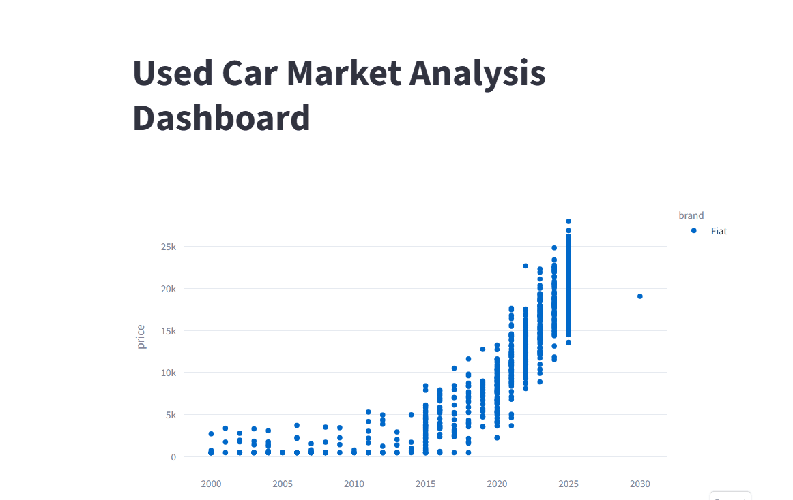
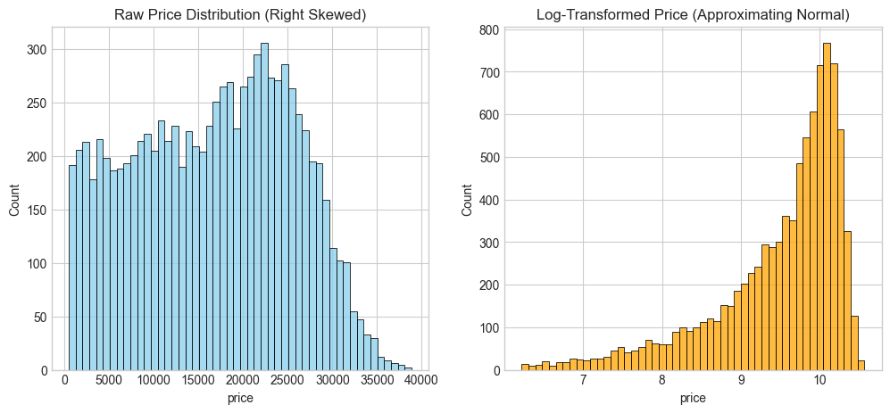
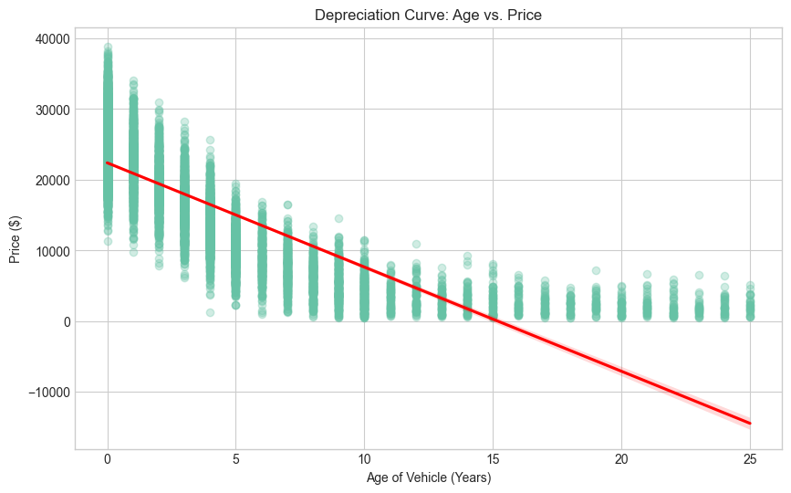

# Used Car Market Analysis: Identifying Key Price Drivers

# 📌 Project Overview

The used car market is one of the most information-asymmetric industries, where pricing decisions are influenced by multiple hidden technical and market factors.

This project performs a comprehensive Exploratory Data Analysis (EDA) on a dataset of 10,000 vehicles to identify:
- Major resale value drivers
- Vehicle depreciation behavior
- Technical factors affecting pricing
- Market patterns and anomalies
- Data integrity issues commonly found in real-world datasets

Unlike beginner-level EDA projects that focus only on charts and summary statistics, this project attempts to simulate a more industry-oriented analytics workflow by integrating:
- Literature-backed analytical reasoning
- Business-oriented reporting
- Professional stakeholder communication
- Interactive data exploration

---

👉 [Click Here to Open the Interactive Dashboard](https://dashboard-usedcars.streamlit.app/)

<p align="center">
  
</p>

---


# 📖 Research Context & Literature Review

A major objective of this project was to move beyond “visualization-only analysis” and ground the investigation in existing industry research.

This analysis was inspired and guided by findings from published studies on used vehicle pricing dynamics, particularly the work of **Xinru Chen et al.**

## Key Research Findings Incorporated into This Project

### 🚗 Primary Technical Predictors
Literature suggests that:
- **Max Power**
- Vehicle Age
- Average Cost Price

are among the strongest predictors of resale value.

This project validates and investigates these relationships through exploratory analysis.

---

### 📉 Depreciation Patterns
Research consistently shows that:
- Vehicle prices experience sharp early depreciation
- Depreciation slows down as vehicles age
- Mileage negatively impacts resale value

These patterns were explored and visualized in this project.

---

### 📊 Industry Visualization Standards
The literature also emphasizes:
- Histograms for detecting skewness
- Boxplots for outlier analysis
- Correlation studies for feature interaction understanding

These methods form the analytical foundation of this repository.

---

📚 All referenced papers and supporting research material are included in the `references/` folder.

---

# 📑 Professional Reports & Presentation Decks

<p align="center">
  
</p>

[View Full Report](reports/Used%20Car%20Market%20Analysis.pdf)

This repository is designed not only as a coding project, but also as a demonstration of professional analytical communication.

In real-world industry environments, data scientists and analysts are expected to:
- Present insights clearly
- Communicate with stakeholders
- Translate technical findings into business language
- Prepare management-friendly reports

To simulate this workflow, this project includes a dedicated `reports/` folder containing professional deliverables.

---

## Included in the `reports/` Folder

### 📊 Executive Presentation Deck
A stakeholder-oriented slide deck prepared for:
- Business presentations
- Management reviews
- Insight communication
- Strategic discussions

---

### 📄 Analytical Documentation
Professional reports summarizing:
- EDA findings
- Market observations
- Pricing trends
- Business implications
- Key analytical conclusions

---

## 💼 Skills Demonstrated Through the Reports

- Data storytelling
- Business communication
- Insight presentation
- Professional reporting
- Stakeholder-focused analytics
- Translating technical analysis into strategic insights

----------------------------


# 📊 Key Analytical Insights

## 1️⃣ Price Distribution & Normalization

Initial exploration revealed a heavily right-skewed price distribution, indicating the presence of premium-priced outlier vehicles.

To improve analytical stability:
- Log transformations were applied
- Distribution symmetry improved
- The dataset became more modeling-friendly




*Comparison of raw and log-transformed price distributions.*

---

## 2️⃣ Depreciation Trends & Technical Drivers

The analysis identified a strongly non-linear depreciation relationship:
- Maximum value loss occurs during the first few years
- Depreciation gradually stabilizes over time

Additionally:
- Vehicle power emerged as a stronger price driver than utility features like seating capacity
- Technical specifications showed stronger relationships with price than expected



*Relationship between vehicle age and resale value.*

---

## 3️⃣ Data Integrity & Data Audit

A systematic data audit identified several real-world data quality issues:
- Unrealistic manufacturing years
- Negative mileage values
- Inconsistent records

Approximately **11% of records required correction or validation** before analysis.

This highlights the importance of:
- Data validation
- Cleaning pipelines
- Analytical rigor in practical data science workflows

---

# 📖 Data Dictionary

| Column Name | Data Type | Description |
| :--- | :--- | :--- |
| **car_id** | Integer | Unique identifier for each vehicle |
| **brand** | String | Vehicle manufacturer |
| **model** | String | Specific model name |
| **year** | Integer | Manufacturing year |
| **mileage** | Float | Distance driven in kilometers |
| **fuel_type** | String | Fuel category |
| **transmission** | String | Manual or Automatic |
| **price** | Integer | Vehicle resale price |
| **age** | Integer | Derived vehicle age |

---

# 🛠️ Tech Stack

## Programming & Analysis
- Python 3.10+
- Pandas
- NumPy
- SciPy

## Visualization
- Matplotlib
- Seaborn
- Plotly

## Deployment
- Streamlit

---

# 📁 Repository Structure

```text
├── data/
│   └── used_cars_mock.csv          # Raw used car dataset
│
├── notebooks/
│   ├── main_notebook.ipynb         # Main Exploratory Data Analysis notebook
│   └── experimental_appendix.ipynb # Additional experiments and analytical observations
│
├── plots/
│   ├── Animation.gif               # Interactive dashboard/demo preview
│   ├── depreciation_curve.png      # Vehicle depreciation analysis
│   ├── price_distribution.png      # Price distribution visualization
│   └── report.gif                  # Presentation/report preview animation
│
├── reports/
│   └── Used Car Market Analysis.pdf # Professional analytical report and presentation deck
│
├── src/
│   └── app.py                      # Streamlit application deployment script
│
├── requirements.txt                # Required Python libraries and dependencies
│
├── .gitignore                      # Git ignored files configuration
│
└── README.md                       # Project documentation
```

---

# 👤 Author

## Parthsarthi Joshi

- LinkedIn: [Parthsarthi Joshi](https://www.linkedin.com/in/parthsarthi-joshi-653121230/)
- Portfolio: [My Portfolio](https://yourportfolio.com)
- GitHub: [vijAI Official](https://github.com/Parthsarthi-lab)
---

# ⭐ Final Note

This project demonstrates how Exploratory Data Analysis can evolve beyond simple visualization into:
- Literature-backed analytical reasoning
- Business-oriented insight generation
- Professional reporting workflows
- Interactive market intelligence systems
- Real-world stakeholder communication